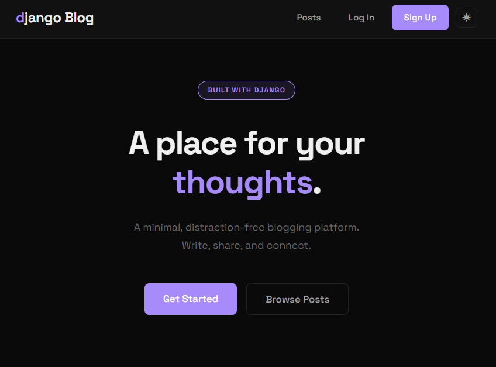

# Django Blog

A minimal, distraction-free blogging platform built with Django. Features a clean, accessible UI with dark/light mode support and a responsive design.



## Features

- **Blog Management**: Create, read, update, and delete (CRUD) blog posts.
- **Authentication**: User registration, login, and logout.
- **Permission Control**: 
  - Public access to landing page and post list.
  - Login required for creating, editing, and deleting posts.
- **Responsive Design**: Fully responsive layout that works on mobile, tablet, and desktop.
- **Dark/Light Mode**: User-toggled theme preference with system auto-detection and persistence.
- **Modern UI**: Styled with CSS variables, smooth transitions, and Space Grotesk typography.

## Tech Stack

- **Backend**: Python, Django
- **Frontend**: HTML5, CSS3 (Custom styling, no frameworks)
- **Database**: SQLite (Default)

## Installation

1. **Clone the repository**
   ```bash
   git clone <repository-url>
   cd blog
   ```

2. **Create a virtual environment**
   ```bash
   # Windows
   python -m venv .venv
   .venv\Scripts\activate

   # macOS/Linux
   python3 -m venv .venv
   source .venv/bin/activate
   ```

3. **Install dependencies**
   ```bash
   pip install django
   ```

4. **Apply migrations**
   ```bash
   python manage.py migrate
   ```

5. **Create a superuser (optional, for admin access)**
   ```bash
   python manage.py createsuperuser
   ```

6. **Run the server**
   ```bash
   python manage.py runserver
   ```

7. **Access the application**
   Open your browser and navigate to `http://127.0.0.1:8000/`.

## Usage

- **Landing Page**: The entry point at `/`.
- **Dashboard/Posts**: View all posts at `/posts/`.
- **New Post**: Click "Write Something" or "+ New Post" (requires login).
- **Edit/Delete**: Options available on individual post detail pages (requires login).
- **Theme**: Toggle between Dark and Light mode using the sun/moon icon in the header.

## Project Structure

```
blog/
├── accounts/           # User authentication app
├── blog/               # Main blog application (models, views, urls)
├── django_project/     # Project configuration
├── static/             # Static files (CSS, images)
├── templates/          # HTML templates
└── manage.py           # Django command-line utility
```

## License

This project is open source and available under the [MIT License](LICENSE).
